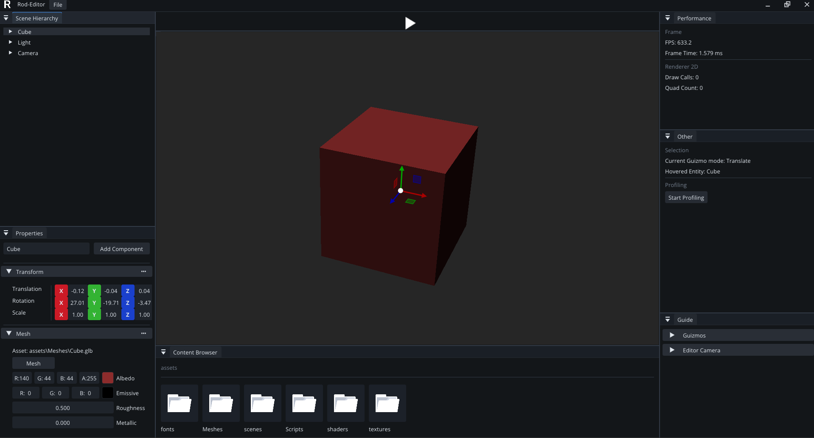

# RodEngine

[](LICENSE)
[](https://github.com/Plecaj/RodEngine/commits/main)

<p align="center">
  
</p>

**RodEngine** is a custom C++ game engine focused on real-time rendering, editor tooling, and modern engine architecture. Originally inspired by parts of The Cherno's game engine series, the project has evolved into an independent engine with its own systems, tools, and long-term vision.

>  RodEngine is currently in early development. APIs, systems, and project structure may change frequently.

---

## Screenshot

<p align="center">
  
</p>

*Editor viewport and tooling preview.*

---

## Why RodEngine?

RodEngine is a long-term project created to explore graphics programming, engine architecture, tooling, and modern C++ development through the process of building a game engine from scratch.

The goal is not to compete with established engines such as Unreal Engine or Unity, but to gain a deep understanding of how game engines work internally while creating a fully functional and extensible development platform.

---

##  Building

###  Prerequisites

- **Windows**
- **Visual Studio 2022 / MSVC** with the **Desktop development with C++** workload
- **Git**
- **Python 3.x**
- **CMake 3.25+**


### 1. Clone the repository

This project uses Git submodules, so it is **recommended** to clone with:

```bash
git clone --recursive https://github.com/Plecaj/RodEngine
cd RodEngine
```

If you already cloned the repository without submodules:

```bash
git submodule update --init --recursive
```

---

### 2. Sync shaderc dependencies

The project requires additional dependency setup for `shaderc`.

Navigate from the project root to the `shaderc` directory:

```bash
cd RodEngine/vendor/shaderc
```

Run the sync script:

```bash
python utils/git-sync-deps
```

> Make sure you have Python 3.x installed.

---

### 3. Generate build files (CMake)

Go back to the project root directory and run the Visual Studio preset:

```bash
cd ../../..
cmake --preset vs
```

---

### 4. Build the project

```bash
cmake --build --preset vs-debug
```

---


###  Notes

- Failing to initialize submodules will result in build errors.
- Running `git-sync-deps` is required for the default vendored `shaderc` setup — skipping it may cause missing `shaderc` dependencies.
- The `vs` preset uses **Visual Studio 17 2022**, **x64**, **C++23**, vendored `shaderc`, and generates files into `build/vs`.
- Available build presets are `vs-debug`, `vs-release`, and `vs-dist`; the main executable target is `Rod-Editor`.
- Build outputs are written under `build/vs/bin/<Config>/`.


## Tech Stack

| Category | Technology |
|-----------|------------|
| Language | C++ |
| Build System | CMake |
| Rendering | OpenGL |
| Windowing & Input | GLFW |
| GUI | ImGui, ImGuizmo |
| ECS | entt |
| Math | GLM |
| Logging | spdlog |
| Image Loading | stb_image |
| Shader Compilation | Shaderc |

---


## License

This project is licensed under the MIT License.

See the [LICENSE](LICENSE) file for more information.
