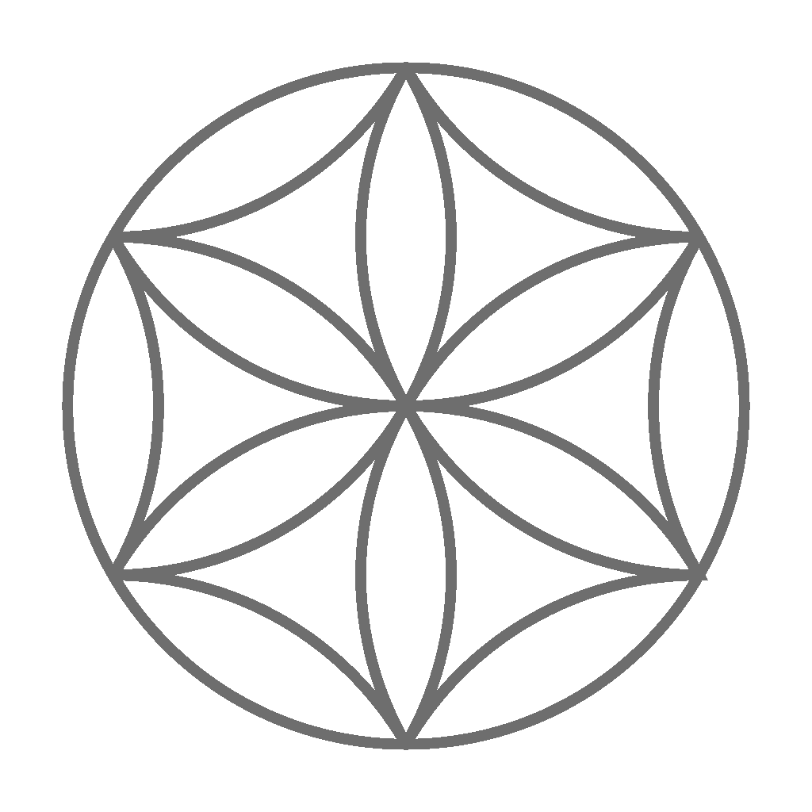

# RodEngine

[](LICENSE) [](https://github.com/Plecaj/RodEngine/commits/main)

<p align="center">
  
</p>

**RodEngine** is a custom C++ game engine I'm building from scratch. It's based on some part of [The Cherno's](https://www.youtube.com/@TheCherno) game engine series, which serves as the foundation for learning and early development. Now I expand the engine with my own architecture, features, and tools.  

##  Development Status
>  RodEngine is in early development. Expect rapid changes, incomplete systems, and experimental features.
 
##  Building

###  Prerequisites

- **Windows**
- **MSVC** (should be fine in other compilers, but hasnt been tested)
- **Git**
- **Python 3.13+**
- **CMake 3.30+**


### 1. Clone the repository

This project uses Git submodules, so it is **recommended** to clone with:

```bash
git clone --recursive <repo_url>
```

If you already cloned the repository without submodules:

```bash
git submodule update --init --recursive
```

---

### 2. Sync shaderc dependencies

The project requires additional dependency setup for `shaderc`.

Navigate starting from project root direcotry forwards to:

```bash
cd RodEngine/vendor/shaderc/utils
```

Run the sync script:

```bash
python git-sync-deps
```

> Make sure you have Python 3.x installed.

---

### 3. Generate build files (CMake)

Go back to the root directory and run:

```bash
cmake -S . -B build
```

---

### 4. Build the project

```bash
cmake --build build
```

---


###  Notes

- Failing to initialize submodules will result in build errors.
- Running `git-sync-deps` is required — skipping it may cause missing `shaderc` dependencies.

##  Tech Stack

-  **Platform:** Windows  
-  **Language:** C++  
-  **Build System:** CMake  
-  **Rendering:** OpenGL  
-  **Windowing & Input:** GLFW (with minor changes for no windows titlebar support)
-  **Math Library:** GLM  
-  **GUI:** ImGui, ImGuizmo  
-  **ECS Library:** entt  
-  **Logging:** spdlog  
-  **Image Loading:** stb_image  
-  **Shader Compilation:** Shaderc

##  Goals

###  Rendering
- High-performance 3D rendering with support for meshes, models, materials, and textures  
- Physically-Based Rendering (PBR) pipeline with real-time lighting and shadows  
- Support for multiple rendering APIs (OpenGL, Vulkan, DirectX, Metal)  
- Efficient batching, frustum culling, and draw call optimization  
- Post-processing effects: bloom, HDR, motion blur, and SSAO  

###  Editor & Tools
- Built-in 3D scene editor with drag-and-drop functionality  
- Visual UI editor for interfaces, menus, and HUDs  
- Real-time preview and live editing of scenes and assets  
- Asset management for models, textures, shaders, animations, and audio  

###  Platform Support
- Cross-platform support: Windows, Linux, macOS

###  Audio
- 3D spatial audio engine with sound positioning  
- Sound effects and music management with mixing, layering, and attenuation  

###  Scripting
- C# scripting support with hot-reload capability  
- Easy-to-use API for engine features and gameplay logic  

###  Physics
- 3D physics engine with rigid bodies, colliders, and joints  
- Collision detection, resolution, and physics simulation  


##  Credits

Special thanks to [The Cherno](https://github.com/thecherno) for the incredible game engine tutorial series, which helped start project.

---

