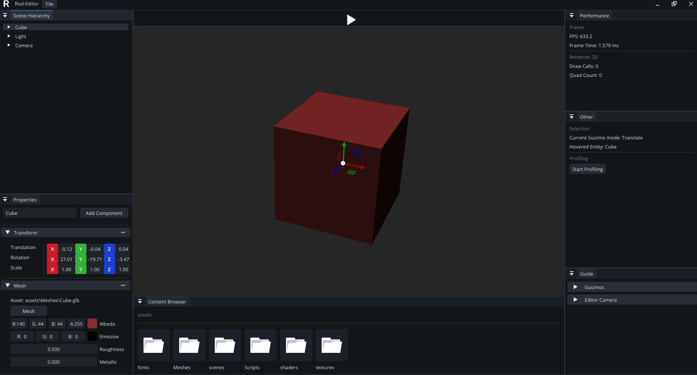

<div align="center">
  

  # RodEngine

  Custom C++ game engine and editor focused on rendering, tooling, scripting, and engine architecture.

  [](LICENSE)
  [](https://github.com/Plecaj/RodEngine/commits/main)
  
  
  
  
</div>

RodEngine is a hands-on engine project focused on building the core systems directly: rendering, scene management, editor tools, C# scripting, and the runtime/export pipeline.

It is not intended to compete with engines like Unity or Unreal. The project is still in early development, so APIs and workflows may change.

> **Project status:** early development. The editor and runtime are usable, but the API is not stable yet.

<p align="center">
  
</p>

## At A Glance

| Area | Current state |
| --- | --- |
| Editor | Dockable ImGui editor with viewport, hierarchy, properties, content browser, toolbar, debug, guide, and performance panels |
| Scene system | ECS scenes with UUID entities, serializable components, editor/runtime update paths, and scene copying for play mode |
| Rendering | Batched 2D renderer, 3D mesh renderer, directional lights, shadow depth passes, GLB loading, and material data |
| Scripting | .NET 9 C# scripting hosted from C++, with reflected script fields and runtime reload support |
| Runtime | Separate game runtime executable with editor export into `exports/RodGame` |

## Highlights

| Feature | Why it matters |
| --- | --- |
| Editor play mode copies the scene | Runtime changes do not overwrite editor data |
| Framebuffer entity picking | The editor can select entities directly from the viewport |
| YAML scene serialization | Scenes store entities, components, materials, scripts, and script field values |
| Shaderc + SPIR-V cache | Multi-stage GLSL shaders are compiled and cached instead of rebuilt every time |
| C# metadata reflection | Script classes and serializable fields show up in the editor |
| Runtime/export path | Scenes can be packaged with assets and launched outside the editor |

## Implemented Systems

### Editor

- Custom title bar and dockspace layout.
- Scene hierarchy and properties editing.
- Content browser with drag and drop for scenes, textures, and GLB meshes.
- Viewport rendering through a framebuffer.
- Entity picking from an integer framebuffer attachment.
- Transform gizmos with ImGuizmo.
- Play and stop workflow.
- Scene open, save, save as, and game export.

### Scene System

- ECS model based on `entt`.
- Stable UUIDs for entities.
- Components for transform, camera, sprite renderer, mesh, directional light, and C# script.
- YAML serialization for scene data.
- Separate editor and runtime update paths.
- Scene copying before play mode.

### Rendering

- OpenGL backend with a renderer abstraction layer.
- Batched 2D quad renderer with texture slots and draw stats.
- 3D renderer with mesh submission and material data.
- Directional lights and shadow map depth passes.
- GLB mesh loading through `tinygltf`.
- Material properties for albedo, emissive color, roughness, and metallic.
- Multi-stage GLSL files compiled with `shaderc` into SPIR-V.
- YAML-backed shader cache database.

### C# Scripting

- .NET 9 runtime hosted from C++ through `hostfxr`.
- Script projects built with `dotnet build`.
- Game scripts loaded into a collectible `AssemblyLoadContext`.
- Script classes and serializable fields reflected into editor UI.
- Native calls for logging, input, entities, components, transforms, cameras, sprites, meshes, materials, lights, and script data.
- Script source changes detected while the editor is running.

### Runtime And Export

- `Rod-Runtime` runs scenes without the editor UI.
- Editor export copies the runtime executable, assets, and startup scene.
- Runtime loads `assets/scenes/Startup.rod`.

## Current Limitations

| Area | Current limitation |
| --- | --- |
| Platform | Windows is the main supported platform right now. Several systems use Windows-specific paths or APIs. |
| Rendering backend | The renderer abstraction exists, but OpenGL is the only implemented backend. |
| Asset pipeline | Asset handling is still simple. The editor currently works with scene files, PNG textures, and GLB meshes. |
| Mesh loading | GLB loading is focused on static mesh data and basic material values. It is not a full glTF asset pipeline yet. |
| Gameplay systems | Physics, audio, animation, prefab workflows, and asset importing tools are not implemented yet. |
| Editor UX | The editor is usable, but many workflows are still early and will change as the engine grows. |

## Code Map

| Area | Start here |
| --- | --- |
| Editor shell | `Rod-Editor/src/EditorLayer.cpp` |
| Editor panels | `Rod-Editor/src/Panels/` |
| Scene and ECS | `RodEngine/src/Rod/Scene/` |
| 2D renderer | `RodEngine/src/Rod/Renderer/Renderer2D.cpp` |
| 3D renderer and shadows | `RodEngine/src/Rod/Renderer/Renderer3D.cpp` |
| Shader compilation | `RodEngine/src/Rod/Platform/OpenGL/OpenGLShader.cpp` |
| Shader cache | `RodEngine/src/Rod/Renderer/ShaderCacheDatabase.cpp` |
| C# script hosting | `RodEngine/src/Rod/Scripting/` |
| Managed script API | `Rod-ScriptCore/Source/` |
| Standalone runtime | `Rod-Runtime/src/` |

## Tech Stack

| Area | Technology |
| --- | --- |
| Language | C++23, C# |
| Build | CMake, Visual Studio 2022, .NET SDK |
| Rendering | OpenGL, shaderc, SPIR-V |
| UI | Dear ImGui, ImGuizmo |
| ECS | entt |
| Scene files | YAML |
| Mesh loading | tinygltf |
| Logging | spdlog |

## Build

RodEngine is currently Windows-first.

### Requirements

- Windows
- Visual Studio 2022 with the Desktop development with C++ workload
- CMake 3.25+
- Git
- Python 3.x
- .NET 9 SDK

### Clone

```bash
git clone --recursive https://github.com/Plecaj/RodEngine
cd RodEngine
```

If the repository was cloned without submodules:

```bash
git submodule update --init --recursive
```

### Sync shaderc

The vendored `shaderc` dependency needs its own dependency sync:

```bash
cd RodEngine/vendor/shaderc
python utils/git-sync-deps
cd ../../..
```

### Configure and build

```bash
cmake --preset vs
cmake --build --preset vs-debug
```

The debug editor executable is written to:

```text
build/vs/bin/Debug/Rod-Editor.exe
```

Other presets are available:

```bash
cmake --build --preset vs-release
cmake --build --preset vs-dist
```

## Notes

- The main target is `Rod-Editor`.
- Building the editor also builds `Rod-Runtime` when runtime builds are enabled.
- The editor copies its assets after build.
- The C# script core and game scripts are built by CMake when `dotnet` is available.

## License

RodEngine is licensed under the MIT License. See [LICENSE](LICENSE).
